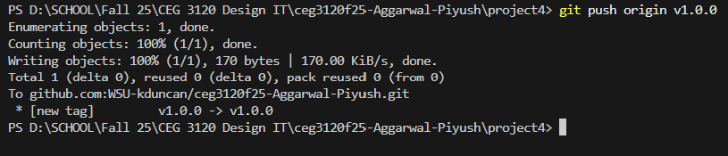
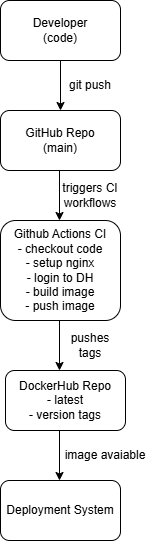

# Project Description & Overview

For this project, my goal was to create a full continuous-integration pipeline for my containerized website. The idea is simple, every time I update my code and push to GitHub, a GitHub Actions workflow will automatically rebuild my Docker image and push it to my public DockerHub repository.

I’m basically automating what I had to do manually in Project 3:
build → tag → push → verify.

The tools used in this project are:

- Docker → to build my web application container

- DockerHub → to store my container images

- GitHub → repository for my project

- GitHub Actions → CI automation that builds and pushes my image

- Personal Access Tokens → authentication for DockerHub inside GitHub Actions

If something breaks later, I can update my site, push to GitHub, and the pipeline automatically publishes a new version.

# Part 1 — Docker container image

I already completed this during Project 3, so instead of rebuilding everything from scratch, I simply copied my web-content folder and my Dockerfile into my new Project 4 repository.

Inside web-content, I included:

- index.html

- details.html

- styles.css

I used generative AI for the website on aws outage.

My Dockerfile is simple and uses two instructions:

- I build from the base image httpd:2.4

- I copy my website files into Apache’s default web directory

To build and tag my image manually (which I already did for Project 3), I used:

`docker build -t 26piyush/aws-outage-site:v1 .`

Then I logged in to DockerHub using my PAT:

`docker login -u 26piyush`

Finally, I pushed the image:

`docker push 26piyush/aws-outage-site:v1`

After pushing, I also pulled the image and ran it locally to verify the website renders correctly.

# Part 2 — GitHub Actions and DockerHub

To make my workflow able to push to DockerHub automatically, I created two GitHub Repository Secrets:

DOCKER_USERNAME

DOCKER_TOKEN

Both are required for the workflow to authenticate and push container images.

Inside .github/workflows, I created a workflow file called:

`docker-workflow.yml`

This workflow runs automatically every time I push updates to main.

Here is what the workflow does:

- Checks out code from the repository

- Sets up Docker Buildx

- Logs in to DockerHub using my secrets

- Builds the Docker image

- Tags it correctly

- Pushes it to DockerHub

After creating the workflow file, I pushed a test update to verify that GitHub Actions triggered successfully. I watched the workflow run in GitHub under the “Actions” tab and confirmed that the new image was published to DockerHub.

Then I pulled the image to verify it worked:

`docker pull 26piyush/aws-outage-site:latest`

`docker run -d -p 8080:80 26piyush/aws-outage-site:latest`

My website loaded properly from the new build.

# Part 3 — Semantic Versioning

By default, “latest” constantly overwrites itself, so part of this project was converting my workflow to support semantic versioning tags.

Now, instead of pushing only “latest,” the workflow also pushes:

- latest

- the major version (example: 3)

- major.minor version (example: 3.8)

Before triggering the workflow, I create git tags like this:

`git tag -a v1.0.0 -m "Initial version"`

`git push origin v1.0.0`

Any time a new tag is pushed, GitHub Actions builds a new image with version-based tags automatically.

# Part 4 — CI Diagram

# PAT

To authenticate DockerHub inside GitHub Actions, I created a Personal Access Token from DockerHub under:

Account Settings → Security → New Access Token

Recommended scopes for this project:

Read

Write

Then I saved the token in GitHub as the secret DOCKER_TOKEN.

# Resources

Here are all resources I used while completing this project:

- Docker Documentation (CI/CD with GitHub Actions)

- GitHub Actions build-push-action documentation

- DockerHub PAT documentation

- Course instructions from the Project 4 assignment